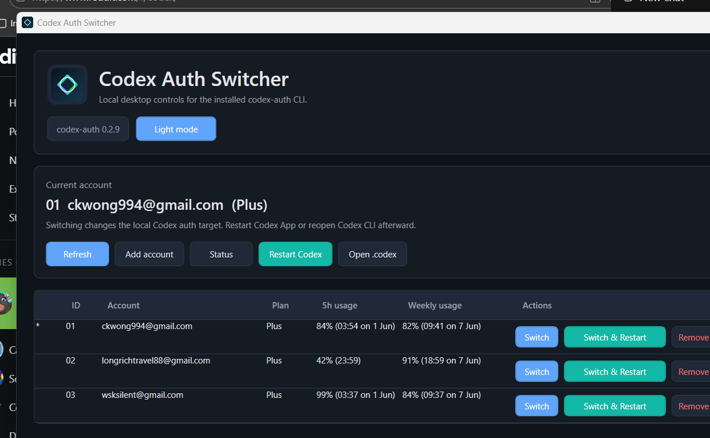

# Codex Auth Windows Switcher

A small Windows desktop UI for the installed [`codex-auth`](https://github.com/Loongphy/codex-auth) CLI.

This is an unofficial companion app. It does not replace `codex-auth`; it only wraps common commands in a WPF interface.



## Features

- List saved Codex accounts with `codex-auth list --skip-api`
- Switch accounts with `codex-auth switch <email>`
- Switch and restart Codex App in one click
- Add accounts with `codex-auth login --device-auth`
- Remove saved accounts with `codex-auth remove <email>`
- Show `codex-auth status`
- Open the local `.codex` folder
- Dark mode and light mode
- Adaptive account list height: up to five accounts are shown, then the table scrolls

## Safety model

The app does not read, write, copy, or parse Codex token files directly. All account operations go through the locally installed `codex-auth` CLI.

By default, the UI lists accounts with `--skip-api` so account switching does not require the optional `codex-auth` account/usage API checks.

## Requirements

- Windows
- .NET 8 Desktop Runtime
- `codex-auth` installed and available on `PATH`
- Codex App if you want the restart button to relaunch the desktop app

Install `codex-auth`:

```powershell
npm install -g @loongphy/codex-auth
```

## Build

Install the .NET 8 SDK, then run:

```powershell
.\scripts\build.ps1
```

The published app is written to:

```text
dist\CodexAuthSwitcher.exe
```

## Install For Current User

After building, install the app into your user-level Programs folder and create a Start Menu shortcut:

```powershell
.\scripts\install-user.ps1
```

The app will be installed to:

```text
%LOCALAPPDATA%\Programs\CodexAuthSwitcher
```

Then search Windows Start for:

```text
Codex Auth Switcher
```

## Development

Project source lives in `CodexAuthSwitcher/`.

Useful commands:

```powershell
.\scripts\build.ps1
.\scripts\install-user.ps1
```

## Relationship To codex-auth

This project is intended as a Windows GUI companion for `codex-auth`. The CLI remains the source of truth for account storage and switching behavior.

## License

MIT
